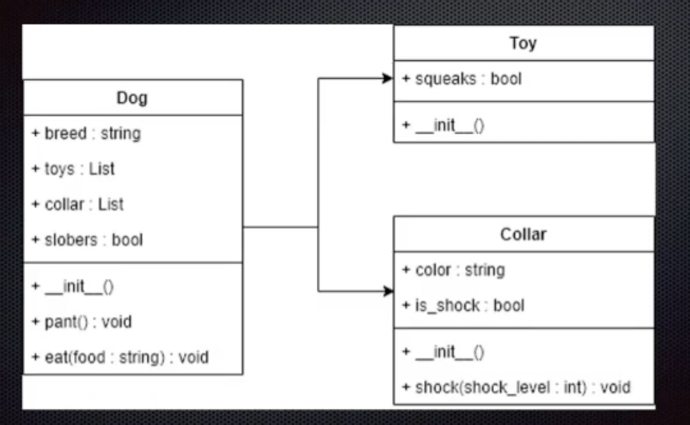

# WEEK 4: OBJECT ORIENTED PROGRAMMING PART II  
\- Notes: https://docs.google.com/document/d/1hMM5pSB3ZVBnWRZlrKwyavUWnxImiZcFSHaqXjhjC3o/edit  
\- Key Concepts: Unified Modeling Language, Class Diagrams 🟨

### PROJECTS IN THIS GIT: 
## ROBOTS VS DINOSAURS
"In previous projects, you became adjusted to the practice of creating the flow of your programs by writing functions and calling functions – this is an approach known as the “functional programming” paradigm.  

Now, with Object Oriented Programming, we are taking a different approach: creating classes to represent the unique data structures in our program, creating instances (objects) from those classes, and having those objects interact with each other in order to create the flow of our program. This creates a “Russian Nesting Doll” effect of all your classes nested inside of larger classes that represent the larger units of functionality for the program."  

Links:  
\- Framework: https://docs.google.com/document/d/1EVXlH0NeBci-1_Fj8vrf_gEonm_98euv/edit#bookmark=id.30j0zll  
\- User Stories: https://docs.google.com/document/d/1bULXFKrhWRpRgjULJ3HMlj9mdsHOc_R_/edit  

## DOG-TOY-COLLAR OBJECTS 
##### Class Diagram:

